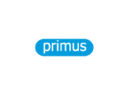

<body class="marcas">   
    

        

            

                
            

            
            

                
            

            
            

                
            

            
            

            
            

            
            

            
            

            
            

            
            

            
            

                
            

            
            

                
            

            
            

                
            

            
            

                
            

            
            

                
            

            
            

                
            

            
            

                
            

            
            

                
            

            
            

                
            

            
            

                
            

            
            

                
            

            
            

                
            

            
            

                
            

            
            

                
            

            
            

                
            

            
            

                
            

            
            

                
            

            
            

                
            

            
            

                
            

            
            

                
            

            
            

                
            

            
            

                
            

            
            

                
            

            
            

                
            

            
            

                
            

            
            

                
            

            
            

                
            

            
            

                
            

            
            

                
            

        

    

</body>

